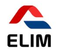

<a name="readme-top"></a>

<!--
HOW TO USE:
The project includes how to parse a Figma design to create a UI using flexbox to place elements in the personal portfolio page also attached images and backgrounds to enhance the look of the website

REQUIRED SECTIONS:
- Table of Contents
- About the Project
  - Built With
  - Live Demo
- Getting Started
- Authors
- Future Features
- Contributing
- Show your support
- Acknowledgements
- License

OPTIONAL SECTIONS:
- FAQ

After you're finished please remove all the comments and instructions!
-->

<div align="center">
  <!-- You are encouraged to replace this logo with your own! Otherwise you can also remove it. -->

  
  <br/>

  # PORTFOLIO MOBILE WEB APP 

</div>

<!-- TABLE OF CONTENTS -->

# 📗 Table of Contents

- [📖 About the Project](#about-project)
  - [🛠 Built With](#built-with)
    - [Tech Stack](#tech-stack)
    - [Key Features](#key-features)
  - [🚀 Live Demo](#live-demo)
- [💻 Getting Started](#getting-started)
  - [Setup](#setup)
  - [Prerequisites](#prerequisites)
  - [Install](#install)
  - [Usage](#usage)
  - [Run tests](#run-tests)
  - [Deployment](#triangular_flag_on_post-deployment)
- [👥 Authors](#authors)
- [🔭 Future Features](#future-features)
- [🤝 Contributing](#contributing)
- [⭐️ Show your support](#support)
- [🙏 Acknowledgements](#acknowledgements)
- [❓ FAQ (OPTIONAL)](#faq)
- [📝 License](#license)

<!-- PROJECT DESCRIPTION -->

# 📖 [ Portfolio - Microverse project ] <a name="about-project"></a>


**[ Portfolio Microverse project ]** is a mobile app project,  the objective of the project is to understand how to parse a Figma design to create a UI.

- 
- 
- 
- 
- 

## 🛠 Built With <a name="built-with"></a>

### Tech Stack <a name="tech-stack"></a>

> The tech stack and the relevant sections that apply to this project are the following: 

<details>
  <summary>Version control system</summary>
  <ul>
    <li><a href="https://www.figma.com/file/l7SqJ3ZfkAKih9sFxvWSR4/Microverse-Student-Project-1?node-id=0%3A1">figma</a></li>
    <li><a href="https://devdocs.io/html/">HTML</a></li>
    <li><a href="https://devdocs.io/css/">CSS</a></li>
    <li><a href="<li><a href="https://devdocs.io/css/">Flex</a></li>
  </ul>
</details>

<details>
  <summary>Linters</summary>
  <ul>
    <li><a href="https://github.com/microverseinc/linters-config">Linters</a></li>
  </ul>
</details>

<details>
<summary>Client</summary>
  <ul>
    <li><a href="https://devdocs.io//">HTML, CSS, Javascript</a></li>
  </ul>
</details>


<p align="right">(<a href="#readme-top">back to top</a>)</p>

<!-- LIVE DEMO -->

## 🚀 Live Demo <a name="live-demo"></a>

> Add a link to your deployed project.

- [Live Demo Link](https://stenlisuryadinata.github.io/portfolio/)

<p align="right">(<a href="#readme-top">back to top</a>)</p>

<!-- GETTING STARTED -->

## 💻 Getting Started <a name="getting-started"></a>

> This project initialized by parsing a Figma design to create a UI, and then we use Flexbox to place elements in the app. this project is a good palyground to enhance the understanding of how mobile app are created.

### Prerequisites

In order to run this project you need:


Example command:

In the first commit of all branch that create the mobile app should be stored in your local machine by cloning a repository using the command line


```sh
# cd my-folder
# Makes a bare clone of the external repository in a local directory
```
 

### Setup

Clone this repository to your desired folder:


Example commands:

```sh
  $ git clone --bare https://external-host.com/EXTUSER/REPO.git
  # Makes a bare clone of the external repository in a local directory
```
### To Push the locally cloned repository to GitHub using the "mirror" option, are as follows: 
```sh
  $ git clone --bare https://external-host.com/EXTUSER/REPO.git
  # Makes a bare clone of the external repository in a local directory
```
### Remove the temporary local repository, are as follows: 
```sh
  $ cd ..
  $ rm -rf REPO.git
```


<p align="right">(<a href="#readme-top">back to top</a>)</p>

<!-- AUTHORS -->

## 👥 Stenli Suryadinata <a name="authors"></a>

> Mention all of the collaborators of this project.

👤 **Dr Angela Yu**

- GitHub: [@githubhandle](https://github.com/angelabauer)
- LinkedIn: [LinkedIn](https://twitter.com/yu_angela)

👤
<p align="right">(<a href="#readme-top">back to top</a>)</p>


<!-- SUPPORT -->

## ⭐️ Show your support <a name="support"></a>

> If you like this project , pleas kindly ⭐️ this repo 

<p align="right">(<a href="#readme-top">back to top</a>)</p>

<!-- ACKNOWLEDGEMENTS -->

## 🙏 Acknowledgments <a name="acknowledgements"></a>


I would like to thank for everyone support this repo 

<p align="right">(<a href="#readme-top">back to top</a>)</p>


<!-- LICENSE -->

## 📝 License <a name="license"></a>

This project is [MIT](./LICENSE) licensed.

_NOTE: we recommend using the [MIT license](https://choosealicense.com/licenses/mit/) - you can set it up quickly by [using templates available on GitHub](https://docs.github.com/en/communities/setting-up-your-project-for-healthy-contributions/adding-a-license-to-a-repository). You can also use [any other license](https://choosealicense.com/licenses/) if you wish._

